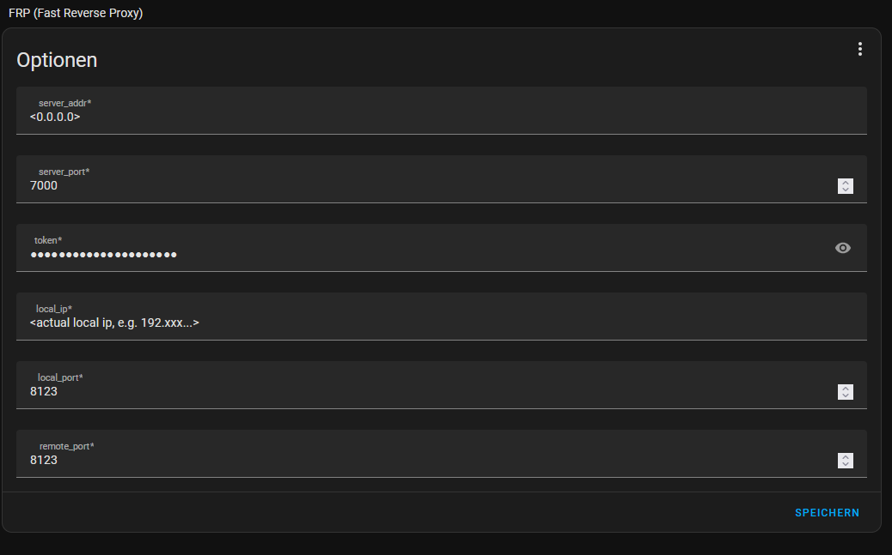

### FRP for Home Assistant
<a href="https://github.com/fatedier/frp">FRP</a> (Fast Reverse Proxy) allows you to quickly setup Remote Access for your Home Assistant instance, if you already have a public VPS with a public IPv4. This is helpful because many home internet connections nowadays, with things like DS-Lite, no longer have their own public IPv4 address, making port forwarding a nightmare.

To setup a FRP Server, please refer to the original projects documentation. This Readme is just for setting up the Add-on to an existing FRP server

[](https://my.home-assistant.io/redirect/supervisor_add_addon_repository/?repository_url=https%3A%2F%2Fgithub.com%2FWeeXnes%2FFRP_HomeAssistant)

### Config


- Server Address
  - your FRP Servers Address
- Server Port
  - your FRP Servers Port (default is ```7000```)
- Token
  - your FRP Servers Token
  - Not necessary but recommended to setup a token on ur FRP server
- Local IP
  - your Actual local IP address, not just ```localhost``` or ```127.0.0.1```
- local Port
  - your local Home Assistant Lovelace Port (default is ```8123```
- remote Port
  - the port you want Home Assistant to be exposed on on the Remote IP
  - leave as default ```8123``` if you have no reason to change it